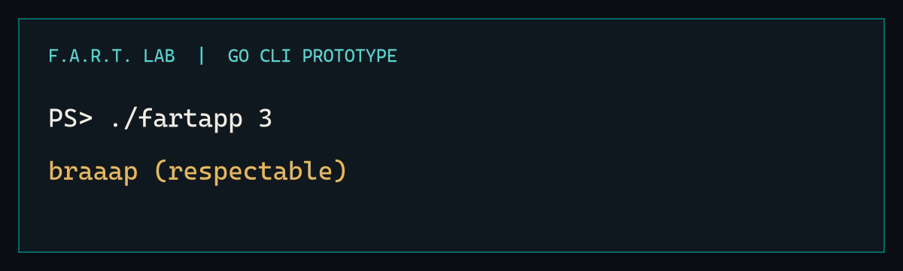
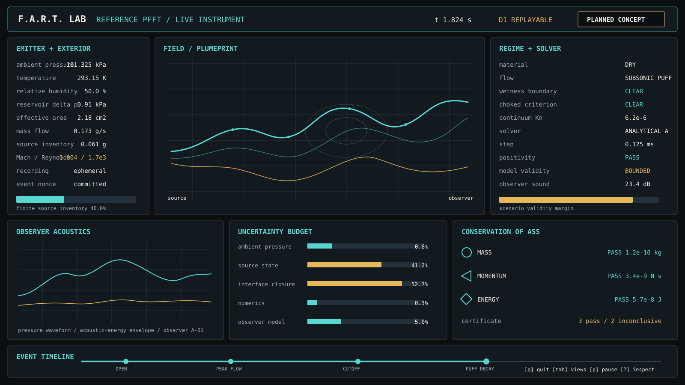
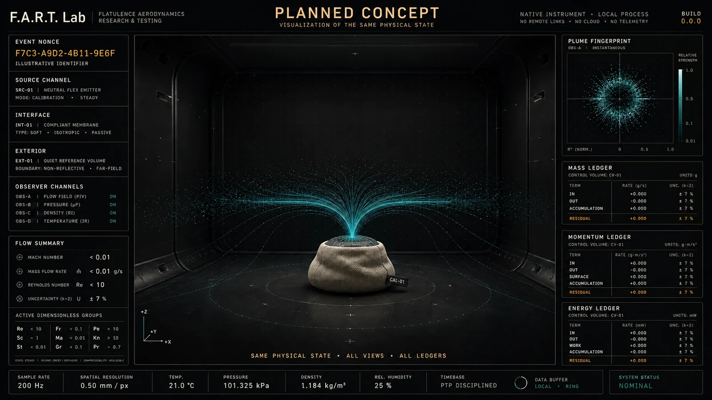
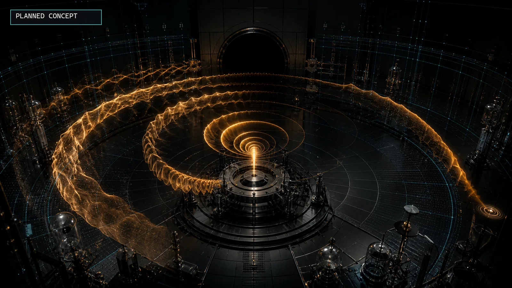

# F.A.R.T. Lab

**Flatulence Aerodynamics Research & Testing**

*From pfft to planetary extinction.*


Candidate identity. The Open Isobar uses one transient wave crossing a measured
boundary as a presentation metaphor, not a universal law. It remains subject to
recognition, confusion, and trademark review before brand lock.

F.A.R.T. Lab is the world's most overengineered and fun fart app. It is a vulgar
comedy game, a serious simulation laboratory, and a Universal Flatulence
Translator for attempting mappings among declared law contexts, structures,
relations, signals, and representations. When compatible participants and humor
exist, release, surprise, and institutional overanalysis might connect beings,
worlds, dimensions, or universes. Universal describes an extensible protocol
for mappings and exact failures to map. It does not claim universal physics,
semantics, observability, or humor. A shared laugh is the comedy premise, not a
schema requirement.

“Fart” is the comic umbrella, not the scientific ontology. An admitted operation
that commits a case begins with only a Lab-local record identity, a law-context
set, an opaque scope, and Lab-level provenance. These describe the software
record, not the furniture of reality. Pre-admission reports need not create that
identity. A declared classifier may then recognize a release, transfer,
relaxation, boundary crossing, or another emission analogue. Occurrence and
realization are optional context concepts or operation capabilities. A case
need not have a source, interface, body, gas, geometry, linear time, passive
observer, familiar causality, objects, shared semantics, or even a mapping into
an Earth category.

The first Earth profile starts with a finite, low-energy synthetic emitter, a
compliant opening, and an ordinary exterior. A pressure vessel belongs to a
later laboratory profile, never the biology-neutral default. In that profile,
one occurrence account drives the plume, sound, vibration, particles, recoil,
boundary response, damage, and controller rumble. Other profiles may describe
a machine, colony, planet, star, distributed intelligence, source-free
transition, or fictional structure under explicitly different laws.

There is no menu of prerecorded farts. In the first Earth profile, a changed
pressure history changes every dependent observable. More generally, every
committed Lab capture gets a unique record identity derived from its law contexts,
applicable scope, operation inputs where present, provenance, and nonce.
Closure, observers, physical time, and source-law recurrence exist only when
declared. Replay presents a retained record. Reconstruction repeats a declared
procedure. Re-enactment
creates a new Lab encounter and makes only the equivalence claims its law
profile supports. The game never swaps in a canned sound or animation.

## Project status

The repository contains the original Go CLI prototype plus the initial
experimental v0.7 laboratory slices. The permanent legacy path accepts an
intensity from 1 to 5 and prints a deterministic, rated emission. A new read-only
law catalog lists and inspects candidate law contexts through the same typed
localized-text and JSON report. A strict scenario probe validates one exact law,
one opaque scope, and explicit capability requests without applying defaults or
performing a realization. It does not contain a physical solver yet, and it
labels that absence explicitly. The next goal is not a graphical wrapper. It is
a genuinely excellent, cross-platform command-line laboratory.

Run `fartapp --help` or `fartapp help` to discover every command implemented in
the current oracle. Topic routes such as `fartapp help law inspect` and
`fartapp help scenario validate` are byte-identical to their leaf help. Help
lists no planned command as executable and performs no simulation, file read,
catalog resolution, environment probe, or network action.

The wider product will be built in this order:

1. **CLI Lab:** every model, parameter, run, sweep, comparison, replay, and proof
   is available headlessly on Windows, macOS, and Linux.
2. **Terminal Lab:** an htop-style live instrument panel presents the same CLI
   capabilities without hiding or duplicating them.
3. **Native Lab:** a polished native desktop game adds compatible spatial
   audio, field visualization, haptics, environments, and destruction through
   the same scientific core.

The desktop app will not be a browser shell, embedded webview, or local web
server. It will be a native Godot application backed by the production physics
core. Every future physics feature follows the same promotion path: CLI first,
terminal instrumentation second, native presentation third.

See the [roadmap](ROADMAP.md) for delivery gates.

## What exists and what is planned



Permanent v0.6 legacy snapshot of the Go prototype. This exact command and
output remain tested as an oracle fixture.

```console
$ ./fartapp 3
braaap (respectable)
```

The first CLI-first laboratory command is also implemented:

```console
$ ./fartapp law list
LAW CONTEXTS

earth.continuum.si@v0alpha1 [design-candidate]
  Earth continuum mechanics in SI
  Biology-neutral candidate context for continuum discharge models under declared Earth conditions; no solver is implemented yet.
conformance.relation.atemporal@v0alpha1 [schema-conformance]
  Atemporal relation conformance context
  A relation-only context with no required ordering, geometry, units, source, or observer.
conformance.opaque.minimal@v0alpha1 [schema-conformance]
```

`law inspect earth.continuum.si` reports law definition, implementation,
closure, applicability, evidence, trust, backend feasibility, and resource
feasibility independently. `--format json` emits the same typed candidate report
as deterministic compact JSON. This experimental inspection report names one
exact versioned law context. Coupled occurrences will use the complete ratified
`LawContextSet`, scope-assignment, and inter-law coupling contracts instead of a
misleading list of bare IDs. Neither report requires an Earth discharge role or
localized prose.

`conformance.relation.atemporal` is a schema-conformance counterexample, not a
solver or an empirical claim about reality. It proves that catalog inspection
works without ordering, geometry, dimensions, units, a localized source, or an
observer before the Earth oracle grows further. Software evidence IDs resolve
inside each inspection to exact Go package and test targets that CI executes.

`conformance.opaque.minimal` is a schema-conformance probe whose dedicated JSON
inspection and minimal scenario report contain no localized presentation
objects or declared optional structural modules. Its IDs, reason codes, and JSON
member names are locale-invariant Lab protocol tokens, not a universal language
or shared meaning. The English text formatter remains a presentation layer.

`testdata/scenarios/multi-law-probe-limit.json` is the corresponding negative
boundary fixture. The provisional scenario schema rejects its two-entry
`contexts` array with `multi_law_not_supported` before parsing either entry or
consulting the catalog. The deterministic report omits the root members
`document_schema`, `law_context`, `scope`, `capabilities`, and
`evidence_registry`, so context-entry order cannot silently select a first
context. All operation assessments remain `not-evaluated`. This is a probe-limit
rejection, not a finding that the named contexts are incompatible or that an
inter-law bridge is missing.

`testdata/scenarios/minimal-opaque-unresolved-capability.json` reaches the next
stage without adding a domain noun. The minimal opaque law resolves, the opaque
capability token `c0` does not, and the report stops at
`capability_not_defined`. It creates no capability result, evidence record,
case, ambient default, or solver claim. Its case-operation axes report selection
`not-declared` and admission and execution `not-applicable`. This is exact
capability-reference resolution evidence, not a case-operation admission,
execution, or policy-refusal result.

The next CLI slice is also executable:

```console
$ ./fartapp scenario validate testdata/scenarios/atemporal-probe.json
SCENARIO PROBE DOCUMENT VALID

Document schema: fart.scenario-probe/v0alpha1
Law context: conformance.relation.atemporal@v0alpha1
Scope: s0
Requested case operation: not-declared (probe_schema_has_no_operation)
Operation admission: not-applicable (operation_not_declared)
Operation execution: not-applicable (operation_not_declared)
Validation stages:
  syntax:                 valid
  schema:                 valid
  law resolution:         resolved
  capability resolution:  resolved
Validator inputs: document_bytes, built_in_law_catalog
Ambient inputs: none
```

The report continues with every capability axis and referenced software
evidence. `--format json` provides the same locale-invariant typed result and
the explicit absence of any requested operation shown above. The parser is
bounded, rejects duplicate and unknown JSON members, and never supplies an
Earth, time, geometry, observer, identity, seed, or resource default. This is an
experimental capability probe, not the full scenario schema or a claim that a
solver ran. See the [scenario probe contract](docs/SCENARIO_PROBE.md).



Planned Earth-discharge Terminal Lab concept. Layout and values are illustrative.
Other law contexts replace these panes through the capability registry rather
than receiving fake Earth fields. The shipped terminal application will be
generated from measured service state and tested as a cell buffer, not painted
to resemble a dashboard.



Planned native concept for the biology-neutral Earth calibration fixture. It is
one optional human-spatial projection, not a body, species, habitat, or
universal law. The native application is a later milestone, after the CLI and
Terminal Lab are complete.
All values, dates, and identifiers in this planned image are illustrative.

## The Reference Pfft

The bare `fart` command will stage `ref:rp1:v1`: a deliberately ordinary, dry,
low-energy encounter from a synthetic biology-neutral calibration fixture under
published conventional Earth conditions. It is a thought experiment toward a
real measurement procedure, not a claim that one body, species, culture,
architecture, language, planet, or universe defines normal.

The coordinate chain is anchored to the exact SI defining constants for time,
length, mass, energy, temperature, and amount of substance. The candidate pfft
then declares a conventional dimensionless trajectory, reference exterior,
observer, uncertainty model, and comparison vector. Constants define the ruler.
They do not magically choose a physiology.

There is no scalar fart unit. Emitted mass, impulse, duration, flow, acoustic
exposure, composition, particle loading, dimensionless signature, and ledger
residuals remain separate measurands. One exact calibration fixture can be
reconstructed to test an implementation. Each everyday realization receives a
fresh record nonce, its own imperfections, and its own Lab record identity. Its
Earth context-occurrence identity claims follow the Earth profile's own rules.

Read the full [metrology contract](docs/METROLOGY.md) and the fictional,
non-normative [French standards debate](docs/DEBAT_NORMATIF.fr.md).

## The scientific premise

The minimum-assumption bounded record contract is:

> The Lab identifies a finite record under one or more versioned law contexts.
> Those contexts alone declare whether occurrence, realization, source-law
> identity, ordering, state, participants, couplings, locality, observables,
> transformations, invariants, and representations exist.

A `LawContextSet` contains one or more `LawContext` entries and assigns each
applicable part of the case scope to one entry. A typed `InterLawCoupling`
owns every bridge rule, compatibility condition, ordering relation, unit or
representation conversion, and cross-context conservation claim. The ordinary
case is a singleton set. The engine never treats two unrelated profiles as one
coupled case merely because a story says that universes met.

This formalism has an honest boundary. The Lab cannot represent a purported
reality that cannot be identified, finitely encoded, versioned, or related to
anything expressible by its schemas. It returns
`outside_representable_ontology` instead of calling that case simulated,
unknown, or incompatible.

An **emission analogue** is a classifier result mapping supported claims to a
release, transfer, relaxation, boundary crossing, or another declared relation.
It need not use occurrence semantics, linear time, separable domains,
continuous geometry, local coupling, dimensional quantities, or an
observer-independent state.

The first Earth-continuum specialization selected for validation is
intentionally biology-neutral:

> A pressure-driven discharge from a deformable reservoir through a compliant
> aperture into an exterior domain.

This supports real thermodynamics, compressible flow, turbulence,
aeroacoustics, multiphase transport, rigid-body recoil, and eventually extreme
gas dynamics. Earth continuum profiles use SI as their canonical unit system.
Other law contexts declare axioms or rules, supported structural modules,
capabilities, compatibility, implementation, and verification. Time, state,
dimension, metric, locality, fields, equations, units, symmetries, invariants,
and conserved currents are optional modules. `not_applicable` is a valid result,
never a fabricated zero or missing Earth field.

For an admitted operation that commits a Lab case, the required top-level
objects are `RecordIdentity`, `LawContextSet`, `Scope`, and `ProvenanceGraph`.
Pre-admission validation and refusal use the outer report envelope defined in
[docs/UNIVERSALITY.md](docs/UNIVERSALITY.md). This table expands the accepted
case identity components and optional profile objects:

| Contract object | Requirement |
| --- | --- |
| Record identity | Unique Lab capture or computation identity and lineage, independent of source-law recurrence |
| Context occurrence identity claims | Optional identities supplied only by contexts that define occurrence identity, plus an optional composite identity only when an inter-law coupling supplies one |
| Law context set | One or more scoped law contexts plus explicit inter-law couplings |
| Scope | Addressable application boundary with only the context-owned bindings or explicit absences that apply |
| Provenance | Versioned inputs, transformations, claims, uncertainty, and retained evidence |
| Measurement interaction | Accepted case input that may couple or back-react and therefore changes case-result identity |
| View profile | Knowledge, accessibility, and privacy projection over retained claims that never changes the Lab account |
| Presentation profile | Locale, layout, sonification, camera, and rendering choices that never change the Lab account |
| Comparison signature | Law-selected relations, invariants, observables, and applicability |

The `earth.continuum.si/discharge` specialization additionally defines:

| Earth discharge role | Representative inputs |
| --- | --- |
| Emitter | Inventory, pressure or driving potential, temperature, volume, composition, compliance |
| Interface | Geometry, topology, elasticity, opening history, orientation, surface condition |
| Exterior | Pressure, gravity, humidity, temperature, medium or vacuum, boundaries, world geometry |
| Payload | Gas, liquid-droplet, and solid-particle mass fractions and size distributions |
| Measurement interactions | Support, ordering or clock, measurement operator, coupling, bandwidth, response, and back-action |
| Numerics | Fidelity level, timestep policy, grid resolution, and random seed |

When a law context declares dimensional equations, the simulator derives an
active dimensionless signature. An Earth gas event may activate pressure ratio,
Mach, Reynolds, Strouhal, Froude, Knudsen, Weber, Stokes, and particle-loading groups. Mach is
not invented where no sound speed exists, and Weber is not reported where there
is no material interface. The labels and jokes are consequences of calculated
state and a versioned classification policy, not hidden presets.

## One Lab account, many traceable projections

```text
law context set + bounded case scope
      |
      v
participants, couplings, rules, measurement interactions, or declared absences
      |
      v
immutable provenance graph under declared law and measurement contexts
      |
      +-> read-only view profiles and generic representations
      +-> compatible adapters: audio, visuals, haptics, narrative, damage
```

Every branch cites the same authoritative Lab account. State, relations,
measured claims, audio blocks, narrative claims, and rendered frames may use
different applicable orderings and resolutions, but every projection records
its inputs, transformation, uncertainty, and hash. A causal edge is claimed only
where the selected law context defines it. Measurement back-action is committed
before an applicable realization and enters the case-result identity. A view or
presentation preference is read-only. Interface layers may render, sonify, and
explain retained claims, but they must not invent a second scientific account.

## Earth discharge regime classification

The classifications are independent axes, not one fake severity ladder. An
event can be wet and choked at the same time.

### Material regime

| Label | Model meaning |
| --- | --- |
| Dry fart | A predominantly single-phase turbulent gas jet |
| Wet fart | Gas carrying suspended droplets with breakup, evaporation, or deposition |
| Shart | Dense liquid or particle loading with meaningful surface deposition |
| Solid fart | `FLATULENCE BOUNDARY CROSSED: EVENT RECLASSIFIED AS FECAL EJECTA` |

### Flow regime

| Label | Model meaning |
| --- | --- |
| Subsonic | Aperture flow remains below Mach 1 |
| Choked | The critical pressure ratio produces sonic flow at the narrowest opening |
| Underexpanded or supersonic | A choked jet expands outside the aperture and may form shock cells |

### Energy and source regime

| Label | Model meaning |
| --- | --- |
| Thermal gas | Ordinary gas chemistry remains applicable |
| Plasma | Ionization is significant enough that the gas model must change |
| Solar | A stellar law and source profile produces an energy release through a declared comic interface |

These English joke labels are localized presentation aliases over stable,
locale-invariant Earth-regime codes. Archives, APIs, scores, and certificates
never use a body word, Earth language, or species assumption as the scientific
identity.

## The Flatulence Similarity Law

For profiles with dimensional governing equations, two cases are strictly
similar only when their nondimensional governing equations, closures, spatial
dimension, normalized geometry, boundary and
initial conditions, material functions, and active dimensionless coefficients
match. Matching a short list of famous numbers is necessary in some models, but
not sufficient in general.

That conditional similarity protocol is Buckingham Pi analysis used as a game
mechanic and a testable engine invariant. It enables a challenge such as
reproducing a compatible case at 1,000 times scale without merely multiplying every value
by 1,000.

This Earth-profile similarity tool contributes to the Universal Flatulence
Translator. Universal describes an
extensible protocol for declaring laws, capabilities, compatibility, and failed
mappings. It is not a claim that one equation or solver models every possible
universe.

1. **Semantic translation** requires a declared shared semantic basis.
2. **Structural mapping** preserves selected relations or invariants without
   claiming shared meaning.
3. **Signal transcoding** preserves a supported signal under channel constraints.
4. **Experience analogy** creates an explicitly comic or artistic presentation.

Strict and approximate comparison are strategies inside compatible semantic or
structural mappings. Failures carry stable reason codes such as
`law_incompatible`, `no_shared_observable`, `no_common_semantic_basis`,
`target_channel_insufficient`, `not_identifiable`, `outside_validity`,
`withheld_by_source`, `forbidden_by_policy`, `undecidable_within_budget`, or
`unknown`. A target outside the bounded formalism returns
`outside_representable_ontology`. Refusal is never mislabeled as physical
incompatibility.

A vacuum cannot preserve external loudness. A universe without surface tension
cannot preserve Weber number. A different spatial dimension generally changes
wave spreading and jet behavior. A localized `UNTRANSLATABLE` presentation can
be a successful answer, but the archive retains the precise reason.

## Plumeprints and Fartflakes

When a compatible human-spatial artifact projection is selected, a Lab record
can leave two record-derived artifacts:

- A **Plumeprint** is a compact two-dimensional scientific fingerprint made
  from supported normalized relations or features. Earth-discharge channels may
  include source history, interface motion, field structure, composition,
  active groups, measurement response, uncertainty, and ledger state.
- A **Fartflake** is a deterministic three-dimensional sculpture grown from the
  same Lab account. In one declared verification view, its silhouette can
  encode a safe, scannable reference to the retained trace.

Each `ArtifactProjectionProfile` records the source structure, observation
profile, target medium and dimensionality, preserved features, embedding,
distortion, information loss, accessibility requirements, and whether the
result is evidence, interpretation, or art. A nonspatial case may produce a
declared lossy projection or a precise unsupported result. The artifact is never
presented as native geometry.

The evidence view keeps applicable axes, units, uncertainty, and provenance. The artifact
view is for terminal display, sharing, merchandise, 3D printing, and memes. It
never borrows scientific authority merely because the same data shaped it. A
flat code fallback remains available, and no artifact embeds a public URL,
private path, or tracking token without explicit action.

The idea is inspired by the way QR-Bloom makes a 3D voxel tree readable as a QR
code from above. This project will use an independent record-derived algorithm
and will not copy its code, weights, shapes, or restricted source assets.

The Lab encounter was unique. The record remains. Source-law recurrence stays a
separate claim. See the complete [snowflake and artifact contract](docs/SNOWFLAKES.md).

The lab gives memorable names to real constraints:

- **The Choked Cheek Criterion:** the aperture reaches sonic mass flow at the
  critical pressure ratio.
- **The Wetness Transition:** droplets break up, remain entrained, or deposit as
  Weber and Stokes behavior changes.
- **The No-Sound-in-Vacuum Lemma:** recoil and transported matter can remain, but
  an external acoustic wave cannot propagate without a medium. Visibility still
  requires particles, condensate, radiation, plasma, or another declared model.
- **Conservation of Ass:** expelled mass, momentum, and energy must be accounted
  for in the reservoir, plume, payload, boundaries, and environment.

## Ways to play

- **Quick Play:** one command evaluates one coherent case under its declared law
  contexts, with a visible case identity, an optional generation seed, a nonce
  commitment when a record will be retained, a supported result, and any
  applicable consequence or relation. Exact absence or refusal is a complete
  result. Recording is chosen before the admitted operation.
- **Broadcast:** a seeded law context, bounded scope, and optional world,
  source, observation, or situated interpretation unfold like
  interdimensional television. The story director reacts only to
  context-scoped retained claims and never rerolls a polite result into a
  disaster.
- **Chill Mode:** sparse admitted operations, long quiet intervals, excellent
  radio, and slow visual art derived from retained claims and representations.
  Earth profiles may add fields, vortices, spectra, uncertainty, and closing
  ledgers. It has no score, grind, or prerecorded emission menu.
- **Freestyle Lab:** edit every supported law, scope, coupling, measurement,
  view, representation, and capability-selected extension, with units only
  where they exist.
- **Challenges and campaign:** solve constrained puzzles across compatible law
  contexts. Earth-discharge paths may progress from ordinary pffts to optional
  apocalypse physics, but they are not the universal prerequisite path.
- **Symphony Mode:** hear compatible retained features as physical acoustics
  where acoustics exist, diagnostic sonification, or an inspectable musical
  interpretation without confusing the three.
- **Agent Play:** humans and software agents play the same rule-governed game
  through CLI commands, a bounded MCP adapter, or longer A2A tasks, with
  declared observations, actions, budgets, and score vectors.

Broadcast, Quick Play, and Chill Mode can carry optional Earth-facing player
soundtrack profiles for long, pleasant viewing sessions. Chill electronica,
deep house, dub techno, and chamber minimalism carry subtle alternate-context
lore without turning every song into a novelty track. A station is diegetic
only when its source profile actually supports audio broadcasting, hosts, and a
radio-like institution. Radio changes presentation only. It cannot alter a
Lab account, narrative canon, scores, or replay identity.

The native experience will open with **The Pressure Standard**, an original
six-second certified calibration ident generated from a fixed reference event.
It is inspectable and reproducible from the CLI, instantly skippable, and
available in silent, captioned, reduced-bass, no-haptics, stereo, binaural, and
supported surround forms. It is not an imitation of an existing audio logo.



Planned Pressure Standard concept. Its audio, motion, captions, haptics, and
ledger responses will derive from one calibration definition. Fresh
realizations may vary their microstructure while the six-second grammar and
final instrument mark remain recognizable.

When declared, a scenario seed derives named streams for law, scope, case
operation, and record provenance, plus optional streams for realization, worlds, entities,
narration, and presentation. A separate nonce commits the unique Lab record.
Changing terminal width, language, camera, or a joke line cannot change the case-result
identity. A recorded episode archive preserves resolved story canon, the trace,
and the exact evidence available for reconstruction. An unrecorded encounter is
allowed to pass.

See [docs/GAMEPLAY.md](docs/GAMEPLAY.md) for the mode and story-director
contracts.

## Why this teaches

The central learning loop is short enough to remain a game:

1. Predict what will happen and name the reason.
2. Execute one supported operation and inspect its result.
3. Ask for the strongest supported relation: causal, derivational,
   constraint-based, dependency-based, correlational, or explicitly unknown.
4. Run an intervention when the law defines one; otherwise compare an alternate
   solution, representation, or declared refusal.
5. Review the evidence, then transfer the idea to a compatible context.

The player learns by testing an explanation or relation, not by memorizing a wall
of equations. Dimension-safe types prevent nonsense inputs, similarity enables
scaling puzzles, committed streams make results reconstructable, and provenance
makes every punchline auditable. Advanced theory earns a place only when it
changes a player action, an observable, or a test.

## CLI Lab

The command line is the primary scientific product, not a debug console for the
eventual app. The planned command surface includes:

```console
fart quick --seed F7-4PK9 --record run.fart
fart broadcast --seed 42 --length standard
fart chill --station drift-93-7 --presentation-density sparse
fart ask "a polite dry pfft on a low-gravity station, under 20 J" --dry-run
fart freestyle reference-enclosure.toml --set emitter.pressure="106 kPa"
fart case run reference-enclosure.toml --output run.fart
fart case inspect run.fart
fart case explain run.fart --why regime.choked
fart case provenance run.fart --to consumers/audio
fart case branch run.fart --set exterior.pressure="0 Pa" --output vacuum.fart
fart case sweep reference-enclosure.toml --vary emitter.pressure="105 kPa..800 kPa" --steps 64
fart case compare small.fart large.fart --nondimensional
fart case verify run.fart --refine timestep
fart case reconstruct run.fart
fart trace replay run.fart
fart audio render run.fart --lane physical --output emission.wav
fart symphony render run.fart --mode split --output score.wav
fart radio play drift-93-7 --seed 42
fart artifact plumeprint run.fart --output plumeprint.svg
fart artifact grow run.fart --output fartflake.glb
fart play start challenge:choked-cheek-01 --seed 42 --json
fart play act PLAY_HANDLE --action set_pressure --value "180 kPa" --json
fart mcp serve --transport stdio
fart archive export run.fart --format json,csv,wav,score
fart doctor
fart update check
fart update
```

Names and flags remain provisional until their schemas are implemented. The
contract is not provisional: commands must compose in scripts, support stable
machine-readable output, explain law-inadmissible states or relations, and never
require a GUI. Human output should be useful at a terminal, while JSON, CSV, and
case archives make every calculation inspectable.

The command tree uses short top-level play modes and consistent noun-then-verb
scientific groups. Contextual help leads with executable examples. `doctor`
explains the installation and environment. `config explain` shows precedence.
`update` respects package-managed installs and performs a signed, digest-checked,
atomic standalone update with rollback. No update check, telemetry, browser, or
network request occurs unless the user explicitly asks for it.

## Terminal Lab

After the CLI is complete and stable, the same core becomes an htop-style
terminal application. `fart lab` is the cockpit of the real scientific tool,
not an animation that happens to display numbers. Like htop, it makes a large
live system legible through stable spatial regions, sortable instruments,
keyboard-first drill-down, compact status, and immediate anomaly visibility.

The overview arranges generic case, law, scope, claim, measurement,
view, comparison, invariant, uncertainty, provenance, solver, and proof
instruments. A capability-driven registry adds a relation, dependency, or
timeline view as applicable. For the Earth
discharge profile those include:

- Reservoir pressure, temperature, volume, mass, and energy.
- Aperture area, compliance, mass flow, Mach number, and structural margin.
- Plume and payload summaries, a character-cell field view, and live Plumeprint.
- Waveform, spectrum, pitch, and enclosure-acoustic diagnostics.
- Dimensionless groups, regime transitions, and challenge targets.
- Mass, momentum, and energy ledgers with numerical residuals.
- Solver health, timestep, refinement, positivity, validity, and uncertainty.
- Capability-selected timeline or relation view, measurement and view profiles,
  artifact state, optional interpretation, radio, and agent or spectator
  activity where enabled.
- Chill Mode pacing, field-art selection, music bus, presentation density, and
  unobtrusive proof status.

Every pane can focus, sort, filter, freeze, compare, inspect provenance, explain
the highlighted value, and copy the equivalent CLI command. Wide terminals show
the coupled system at once. Standard terminals preserve the primary ledger and
field views. Compact terminals use tabs. Below minimum size, the program gives
clear guidance and offers append-only plain watch output.

It will support modern terminals on Windows, macOS, and Linux, detect terminal
capabilities, and provide reduced-color and ASCII fallbacks. Every action must
have an equivalent CLI command or case-file edit so the TUI never becomes a
second, untestable control plane. Cell-buffer snapshots, PTY and ConPTY tests,
grapheme and bidirectional-text cases, terminal restoration tests, and measured
render and input budgets make polish executable.

## Native Lab

Only after the CLI and Terminal Lab are excellent does the full native app
begin. Its first playable target is the biology-neutral Reference Enclosure and
one continuous discharge control that sweeps a curated, physically consistent
path from pfft through turbulent, wet, choked, and underexpanded states. It is a
linked scenario path, not a claim that pressure alone changes moisture content.
The Tiled Chamber is an optional authored Earth realization, not the app's
ontology.

During the sweep, every supported field, procedural sound, boundary response,
particle, deposition, consequence, and haptic projection responds continuously
to the same occurrence history already inspectable in the CLI. The app adds a
world and a feel. It does not add secret physics.

Native Chill Mode lets compatible occurrences and mathematical structures
breathe for long sessions. Music carries the atmosphere while low-attention
occurrences or relations appear through capability-selected representations.
In the Earth Reference Enclosure, that can mean ordinary subsonic events plus
pressure fields, pathlines, vortices, spectra, Plumeprints, Fartflakes,
uncertainty, and conservation as slow visual art. Bubble modes appear only when
the later verified underwater pack is installed. Other profiles receive no
invented Earth fields, geometry, audio, or emitter. Chill remains scoreless,
offline, and free of engagement mechanics.

## Long-term progression concept

This is a cross-version progression concept, not the 1.0 content manifest and
not a hierarchy of worlds. The CLI 1.0 manifest ends with the verified profile
set and fidelity explicitly ratified in its release record. Later entries ship
only at the roadmap milestone that earns their laws, solvers, conformance
fixtures, content review, and interface parity.

1. **Everyday Phenomena:** shape loudness, pitch, duration, transport direction, and
   deposition in a tiled room.
2. **The Wind Tunnel:** discover vortex structures, turbulence, resonance,
   droplet breakup, and similarity scaling.
3. **Myth Lab:** test candle extinction, the brown note, vacuum propulsion, and
   supersonic discharge under controlled conditions.
4. **Orbital Flatulence:** use conservation of momentum for spacecraft attitude
   control and small but honest delta-v maneuvers.
5. **Extreme Gas Dynamics:** move underwater, into vacuum, onto Venus and
   Jupiter, and into extreme gravity.
6. **Universal Translation Office:** translate between different sources,
   observer senses, cultures, environments, scales, and compatible worlds.
7. **Speculative Laws:** enter explicitly fictional dimensions, constants,
   fields, and topologies with axiom-conformance certificates.
8. **Apocalypse Mode:** unlock non-biological energy sources, plasma models,
   relativistic warnings, and planet-scale consequences.

Challenge ideas include producing a perfect C-sharp without crossing the
wetness boundary, translating a formal protocol pfft between compatible
profiles, creating an
underwater bubble symphony, and proving through refinement that a `KABLAM`
classification is robust. An optional Earth-biological evidence profile cannot
become choked just because a slider moved. Choking at sea-level ambient pressure
for a perfect gas with gamma 1.4 needs roughly 90 kPa gauge upstream pressure,
far above measured ordinary biological pressure excursions. Calibration,
laboratory, and extreme source packs must say where their energy came from.

## Architecture direction

| Layer | Responsibility |
| --- | --- |
| Go oracle | Tiny, auditable reference equations, case fixtures, and diagnostics |
| Rust production core and CLI | Deterministic evaluation and simulation, CPU reference, headless play, proof, archives, translation, and replay |
| Native compute backends | Optional C++20 Kokkos builds for CPU, CUDA, HIP, and SYCL, plus non-certifying Metal preview kernels |
| Rust terminal UI | Cross-platform live instrumentation over the same commands and Lab account |
| Native Godot client | Native input, visualization, procedural audio, rooms, haptics, and game progression |
| MCP and A2A adapters | Bounded agent access to the same play services, observations, archives, and tasks |

The Go implementation remains intentionally small. Once an analytical model and
its fixtures are trustworthy there, the Rust production core must match them
within documented tolerances before it can power the CLI, TUI, or native app.

The Earth-continuum implementation will use four fidelity families behind the
same Lab-account contract:

1. A canonical analytical oracle for finite-reservoir flow, compliance,
   choking, recoil, reduced puffs, active signatures, and global ledgers.
2. A reduced coupled real-time model for interface oscillation, integral plume
   and room response, parcel statistics, deposition, and procedural audio.
3. An interactive conservative field solver with compressible finite volumes,
   positivity protection, shock capturing, moving boundaries, axisymmetric
   validation before quantitative 3D claims, and separate time and grid proof.
4. Specialist high-fidelity packs for multiphase breakup, underwater bubbles,
   rarefied transport, plasma, MHD, stellar, relativistic, gravitational, and
   alternate-law cases, each with its own equations and verification suite.

For the detailed scientific contract, see
[docs/SIMULATION.md](docs/SIMULATION.md). For the interface and release rules,
see [docs/INTERFACES.md](docs/INTERFACES.md). The research basis and model
boundaries are collected in [docs/RESEARCH.md](docs/RESEARCH.md). The bounded
meaning of “universal” and its negative-space conformance matrix are in
[docs/UNIVERSALITY.md](docs/UNIVERSALITY.md). The eight-axis assessment core and
singular capability-report ratification gate are recorded in
[docs/CAPABILITY_REPORT.md](docs/CAPABILITY_REPORT.md); the current `v0alpha1`
report remains provisional. Audio,
Symphony Mode, and radio are specified in [docs/AUDIO.md](docs/AUDIO.md). Agent
play and interoperability are specified in
[docs/AGENT_PLAY.md](docs/AGENT_PLAY.md). Cultural and public-interest safeguards
are specified in [docs/CULTURE.md](docs/CULTURE.md). A simulated PhD-level
computer-science design review and its resulting commitments are in
[docs/DESIGN_REVIEW.md](docs/DESIGN_REVIEW.md). The fictional, non-normative
[intercontextual council record](docs/CONSORTIUM.md) prototypes loss-aware
translation humor. The Reference Pfft and its exact
constant chain are in [docs/METROLOGY.md](docs/METROLOGY.md). Record identity,
optional context identity, and 3D artifacts are in
[docs/SNOWFLAKES.md](docs/SNOWFLAKES.md). Progressive
engineering gates are in [docs/QUALITY.md](docs/QUALITY.md).
CPU, GPU, precision, portability, and Mojo decisions are in
[docs/COMPUTE.md](docs/COMPUTE.md). The benchmark registry and claim rules are
in [docs/VERIFICATION.md](docs/VERIFICATION.md). Brand, public remix, and
merchandise plans are in [docs/BRAND.md](docs/BRAND.md),
[docs/COMMUNITY.md](docs/COMMUNITY.md), and
[docs/MERCHANDISE.md](docs/MERCHANDISE.md), with mark status in
[TRADEMARKS.md](TRADEMARKS.md). Locale-invariant semantic tokens and optional
symbolic or nonsymbolic communication profiles are specified in
[docs/LOCALIZATION.md](docs/LOCALIZATION.md).

## Proof, not vibes

Every completed simulation should be able to emit a certificate containing:

- Versioned inputs plus applicable implementation, numerical, ordering,
  discretization, realization, and seed settings.
- Declared state, relation, observable, invariant, and balance claims where the
  law contexts define them.
- Law-specific validity and refinement evidence, with explicit
  `not_applicable`, unknown, and unverified reasons.
- Measurement, view, and presentation transformations, including measurement
  back-action, projection loss, or capability refusal.
- Evidence that every enabled consumer cited the same authoritative Lab account.
- Record, optional context-occurrence identity claims, case-result, trace, and
  reconstruction-lineage identifiers.

Certificate claims are independent: replayable, internally consistent, code
verified, solution verified, empirically validated for a stated domain, or
fictional-law consistent. Conservation and convergence do not prove that the
chosen physical model is true. The certificate reports assumptions, tolerances,
unsupported effects, and inconclusive claims. It is evidence about the
simulation, not a claim that a game model is a medical or aerospace tool.

## Current CLI

### Build

```sh
go build -o fartapp .
```

### Run

```sh
./fartapp <intensity>
```

Intensity must be an integer from 1 to 5.

```console
$ ./fartapp 3
braaap (respectable)
```

### Test

```sh
go test ./...
```

| Intensity | Output |
| --- | --- |
| 1 | `pfft (gentle)` |
| 2 | `toot (respectable)` |
| 3 | `braaap (respectable)` |
| 4 | `blorp (respectable)` |
| 5 | `KABLAM (mighty)` |

The idea is deliberately silly. The implementation should be flawless.

## Contributing, security, and license

See [CONTRIBUTING.md](CONTRIBUTING.md),
[CODE_OF_CONDUCT.md](CODE_OF_CONDUCT.md), and [SECURITY.md](SECURITY.md).

Repository-owned source code, documentation, and approved project media are
licensed under the [Apache License 2.0](LICENSE). A media manifest records any
separately licensed third-party material and the release approval for generated
assets.
