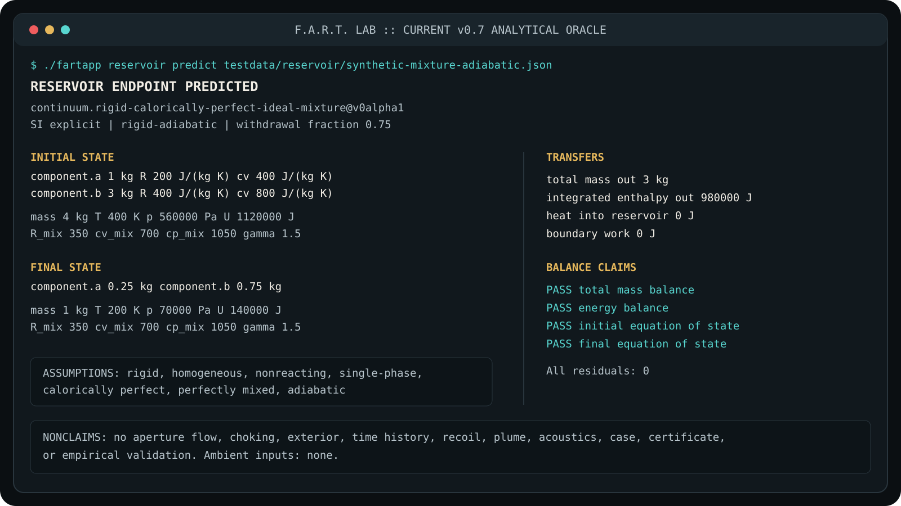

# F.A.R.T. Lab

**Flatulence Aerodynamics Research & Testing**

*From pfft to planetary extinction.*


F.A.R.T. Lab is the world's most overengineered and fun fart app. It is a
vulgar comedy game, a serious simulation laboratory, and an attempt at a
Universal Flatulence Translator. There is no menu of prerecorded farts. One
calculated account must drive every supported sound, visual, particle,
vibration, recoil, damage result, explanation, and controller response.

“Fart” is the comic umbrella, not the scientific ontology. A supported case may
describe a gas discharge, non-gaseous transfer, machine, colony, planet, star,
distributed structure, source-free transition, speculative mathematical model,
or fictional law pack. It need not contain a human, body, source, interface,
Earth, three-dimensional geometry, linear time, observer, shared language, or
shared humor. Universal means extensible mappings and precise failures to map,
not one universal equation. See [Bounded universality](docs/UNIVERSALITY.md).

## Status

F.A.R.T. Lab is experimental v0.8 alpha software. The permanent v0.6 toy output
is stable. Newer commands and schemas remain provisional. The Rust core and
bounded evidence carrier are working foundations for the full v0.8 and v0.9 gates.

| Available now | Not implemented yet |
| --- | --- |
| Dependency-free Go CLI on Windows, macOS, and Linux | Plume, acoustics, particles, chemistry, damage, or haptics |
| Permanent intensity 1 to 5 string oracle in Go and Rust | Certified `.fart` archives, case commitment, or certificate authority |
| Read-only law-context inspection | Natural-language generator, MCP, or A2A play |
| Strict scenario-document validation | htop-style Terminal Lab or native Godot application |
| Exact rigid ideal-mixture reservoir endpoint prediction | Complete trusted `RES-002` blowdown benchmark |
| Quasi-steady restriction flow, component histories, and coupled blowdown | Selective species transport and wall heat-transfer closures |
| Portable Agent Plugins skill with tested CLI recipes | Hosted MCP or A2A services and verified agent-host installations |
| Native Rust reservoir predictor with analytical and Go comparison tests | Stateful `PlayService`, full model registry, and complete Go command parity |
| Opt-in adaptive discharge timing with explicit error estimates and work limits | Fixed-time adaptive stepping and rigorous solution-error bounds |
| Atomic `.fartevidence` capture, integrity verification, replay, and reconstruction | Ratified scientific identities, journals, and archive migration |

The reservoir predictor is a standalone SI continuum model. It accepts explicit
component masses and properties, rigid volume, temperature, closure, and
withdrawal fraction. It predicts exact adiabatic or prescribed-isothermal
endpoints with component, total-mass, energy, and equation-of-state checks. The
restriction predictor adds prescribed or linearly compliant area, subsonic
flow, and the analytical choking boundary. The walking skeleton couples those
oracles in time: rate from the restriction, thermodynamic path from the
reservoir, with mass, energy, and impulse ledgers plus an `L/D` dry-flow
signature. It is not a field solver, plume, sound, occurrence, or case
identity. The [evidence carrier](docs/WALK_EVIDENCE.md) retains the versioned
software account. The supporting catalog and authority experiments are summarized in the
[capability contract](docs/CAPABILITY_REPORT.md) and [roadmap](ROADMAP.md).

## Quick start

```console
go build -o artifacts/bin/fartapp ./cmd/fartapp
./artifacts/bin/fartapp --help
./artifacts/bin/fartapp reservoir predict testdata/reservoir/synthetic-mixture-adiabatic.json
./artifacts/bin/fartapp restriction predict testdata/restriction/gamma15-choked.json
./artifacts/bin/fartapp walk simulate testdata/walk/ordinary-low-pressure.json
./artifacts/bin/fartapp walk refine testdata/walk/ordinary-low-pressure.json --relative-tolerance 1e-8 --max-evaluations 100000
```

On Windows, build with `go build -o artifacts/bin/fartapp.exe ./cmd/fartapp`
and use `./artifacts/bin/fartapp.exe` in the examples. The build creates the
output directory; `artifacts/` is ignored by Git.



The image records the v0.7 presentation of a still-executable synthetic
verification case. Its large values are
chosen for clean analytical checking. They are not a biological default, an
ordinary pfft, or empirical validation. Use `--format json` for the complete
typed report. The [simulation contract](docs/SIMULATION.md) gives the equations
and limits.

The project still preserves the tiny command where it began:

```console
./artifacts/bin/fartapp 3
braaap (respectable)
```


| Intensity | Exact output |
| ---: | --- |
| 1 | `pfft (gentle)` |
| 2 | `toot (respectable)` |
| 3 | `braaap (respectable)` |
| 4 | `blorp (respectable)` |
| 5 | `KABLAM (mighty)` |

Other current examples:

```console
./artifacts/bin/fartapp law list
./artifacts/bin/fartapp law inspect conformance.relation.atemporal@v0alpha1 --format json
./artifacts/bin/fartapp scenario validate testdata/scenarios/atemporal-probe.json
./artifacts/bin/fartapp restriction predict testdata/restriction/ordinary-pressure-subsonic.json
./artifacts/bin/fartapp restriction history testdata/restriction/gamma15-choked-history.json
./artifacts/bin/fartapp walk explain testdata/walk/ordinary-low-pressure.json
./artifacts/bin/fartapp walk branch testdata/walk/ordinary-low-pressure.json
./artifacts/bin/fartapp walk witness testdata/walk/ordinary-low-pressure.json --format json
go test ./...
```

Every command is discoverable from root help. File and standard-input forms are
equivalent. Text is an English presentation; machine tokens are versioned Lab
protocol symbols, not a claim of shared language or meaning.

The [coupled-oracle walkthrough](docs/WALKTHROUGH.md) follows one explicitly
synthetic 100 mL reservoir at about 930 Pa above ambient through prediction,
simulation, explanation, an area counterfactual, arithmetic checks, and retained
witness comparison. It is a low-energy test case, not the ratified Reference
Pfft or a biological measurement. JSON includes every retained sample, component
mass transfers, authored inputs, numerical policy, and evidence limits.

The separate `walk refine` operation regularizes the equalization endpoint,
integrates choking and compliance transitions, and reports estimated time,
impulse, and stroke error. Tolerance satisfaction and completed discharge are
separate outcomes. The [analytical reference](docs/BLOWDOWN_REFERENCE.md)
records independent checks, supported scope, and the remaining `RES-002` work.

Retain an account without copying witness values by hand:

```console
./artifacts/bin/fartapp evidence capture testdata/walk/ordinary-low-pressure.json --output artifacts/ordinary.fartevidence
./artifacts/bin/fartapp evidence verify artifacts/ordinary.fartevidence
./artifacts/bin/fartapp evidence replay artifacts/ordinary.fartevidence
./artifacts/bin/fartapp evidence reconstruct artifacts/ordinary.fartevidence --format json
```

The [Rust foundation](docs/RUST_CORE.md) uses the same authored reservoir
requests through a separate native implementation:

```console
cargo run --locked -p fart-cli -- 3
cargo run --locked -p fart-cli -- reservoir predict testdata/reservoir/synthetic-mixture-adiabatic.json --format json
```

The [project layout](docs/PROJECT_LAYOUT.md) explains package responsibilities,
dependency direction, and why conventional manifests stay at the root.

Agents can use the portable [fartapp-lab skill](skills/fartapp-lab/SKILL.md).
The [integration guide](docs/AGENT_INTEGRATION.md) records its executable
evidence, current protocol versions, and the gates for future MCP and A2A
adapters.

## One calculation, no canned farts

For a familiar continuum specialization, a fart event can be modeled as a
pressure-driven discharge from a deformable reservoir through a compliant
interface into an external medium. That one definition opens real
thermodynamics, compressible flow, turbulence, fluid-structure interaction,
acoustics, multiphase transport, chemistry, orbital mechanics, and eventually
relativistic and cosmological model packs.

The wider platform begins more cautiously:

```text
declared law contexts + explicit inputs + supported operation
                              |
                       one Lab account
                /        /       |       \
             audio    visuals   ledgers   explanations
```

Presentation never edits the scientific account. Humor, locale, soundtrack,
camera, accessibility, and cosmetic source skin are read-only views. A child
can use an Explorer view and a specialist can use a Research view over the same
calculation. Humor may be absent, declined, or untranslatable without making a
case invalid. See [gameplay](docs/GAMEPLAY.md), [culture](docs/CULTURE.md), and
[localization](docs/LOCALIZATION.md).

### Absurd classifications with real boundaries

| Comic label | Scientific boundary |
| --- | --- |
| Dry fart | Predominantly single-phase carrier flow |
| Wet fart | Declared droplets or a supported condensation model |
| Shart | Dense liquid or particle loading with deposition |
| Solid fart | `FLATULENCE BOUNDARY CROSSED: EVENT RECLASSIFIED AS FECAL EJECTA` |
| Choked fart | Mach 1 at the controlling restriction, not automatically a supersonic plume |
| Plasma fart | A selected ionized or reacting model replaces ordinary gas chemistry |
| Solar fart | A stellar source pack disables the biological model |
| Cosmological fart | `DISCHARGE BOUNDARY INVALID: CASE RECLASSIFIED AS COSMOLOGICAL INITIAL DATA` |

The in-game language stays deadpan:

- **The Choked Cheek Criterion:** the selected restriction reaches sonic flow.
- **The Wetness Transition:** multiphase behavior appears only when supported
  breakup, transport, and deposition conditions are met.
- **The No-Sound-in-Vacuum Lemma:** recoil and structural vibration may remain,
  but no exterior acoustic wave propagates without a supporting medium.
- **Conservation of Ass:** every represented unit of mass, momentum, and energy
  must appear somewhere in the applicable ledger.

“Keep it subsonic for this test” is funny because it is also a real instruction.
The project does not let comic wording create an unsupported regime.

Bulk composition, trace odorants, reaction chemistry, condensation, aerosols,
observer detection, and hazard assessment are separate future capabilities.
Detectable does not mean hazardous, and undetectable does not mean safe. A
humorous “Big Butt” or “Small Butt” native preset will be a localized label over
an inspectable morphology and material parameter patch, never a scientific body
type or a hidden change to composition, health, identity, or social worth.

## The Reference Pfft

The Reference Pfft is a future low-energy, biology-neutral calibration concept
for the first ordinary continuum case. It begins at explicitly declared ambient
conditions with a soft synthetic source and a finite budget. It is not an SI
unit, a biological norm, or a claim that one event can be recreated as the same
encounter.

The project treats impermanence seriously. A retained record can be presented
again. A calculation can be reconstructed. A new enactment is still a new
encounter. The synthetic Paris standards-board debate explores whether a
universal-constant traceability chain could standardize measurands without
standardizing the fart itself. It is openly fictional brainstorming, not a real
meeting or endorsement. See [metrology](docs/METROLOGY.md) and the
[French debate](docs/DEBAT_NORMATIF.fr.md).

## Product path

The promotion order is non-negotiable:

1. **CLI Lab:** every model, parameter, run, sweep, comparison, and proof is
   available headlessly.
2. **Terminal Lab:** an htop-style live instrument exposes the same services.
3. **Native Lab:** a polished Godot application adds spatial audio, field
   visualization, haptics, worlds, story, and destruction.

The desktop application will not be a browser shell, embedded webview, or local
web server. CLI first is a delivery discipline, not a requirement that later
surfaces spawn a CLI process.

| Layer | Direction |
| --- | --- |
| Go oracle | Small, independent analytical references and permanent fixtures |
| Rust core | Typed domain, deterministic services, CLI, and Terminal Lab |
| Native compute | Optional verified CPU and accelerator field backends |
| Godot | Native Windows, macOS, and Linux presentation over the same services |
| MCP and A2A | First-class agent adapters over canonical actions and observations |

See [interfaces](docs/INTERFACES.md) and [compute](docs/COMPUTE.md).


Planned Terminal Lab concept. Values are illustrative. Unsupported law contexts
replace entire panes instead of receiving fake Earth fields.


Planned native Earth-continuum projection. It is one optional spatial view, not
a body, habitat, species, or universal default.

## Ways to play

- **Quick Play:** one immediate generated encounter with an explanation.
- **Broadcast:** watch a seeded universe, being or non-being, source, story, and
  scientific account like interdimensional television.
- **Chill:** subtle simulated structures, occasional releases, and music.
- **Freestyle:** construct, compare, sweep, amplify, and deliberately cross
  model boundaries.
- **Challenges:** optimize pitch, orbit, plume, damage, or similarity under
  honest mass, energy, numerical, and safety budgets.
- **Symphony:** organize procedural emissions through music theory without
  replacing physical audio with canned samples.
- **Forecast Desk:** compare compatible analytical, field, ensemble, and learned
  guidance without hiding disagreement or treating consensus as truth.
- **Agent Play:** humans and software agents receive equivalent actions,
  observations, budgets, and evidence through CLI, MCP, and A2A adapters, with
  long-running tasks, branches, notebooks, ensembles, and multiplayer roles.

Questions can range from “what would a ladybug-scale hypothetical source look
like after declared amplification?” to “what happens if the discharge boundary
is replaced by cosmological initial data?” The first must not invent insect
biology. The second must not describe the Big Bang as an explosion into an
exterior. String theory, extra dimensions, quantum superposition, analogue
gravity, cosmology, and fictional universes receive different model and
evidence classes. An exquisitely precise refusal is a valid result and often a
good punchline.

A **Plumeprint** is a declared two-dimensional projection of one retained
account. A **Fartflake** is a three-dimensional projection whose topology,
coordinates, distortion, and loss are explicit. Neither is the event itself.
See [snowflake artifacts](docs/SNOWFLAKES.md).


The planned Pressure Standard is an original audiovisual ident derived from
the same model state as the interface. It will not imitate a familiar cinema
logo, chord, pitch rise, cadence, or reveal. See [audio](docs/AUDIO.md).

## Proof standard

Every scientific feature must state:

- its law or model, assumptions, applicability envelope, and unsupported
  effects;
- its conservation and positivity evidence where those concepts apply;
- whether the claim is code verification, solution verification, empirical
  validation, literature-relative consistency, analogy, or fictional-axiom
  conformance;
- the exact implementation, precision, backend, and fixture revision needed to
  interpret the result.

The quality floor is 90 percent aggregate Go statement coverage and 80 percent
for every package, with stricter tests for numerical, protocol, archive, and
security code. Functional tests are not enough. The project also requires
properties, fuzzing, race checks, static analysis, cross-platform builds,
independent analytical fixtures, and progressively stronger numerical and
physical validation. It does not imply NASA, university, standards-body, or
laboratory approval. See [quality](docs/QUALITY.md),
[verification](docs/VERIFICATION.md), and [research](docs/RESEARCH.md).

## Documentation

| Area | Documents |
| --- | --- |
| Science | [Simulation](docs/SIMULATION.md), [models and ML](docs/MODELS.md), [research](docs/RESEARCH.md), [verification](docs/VERIFICATION.md), [compute](docs/COMPUTE.md), [metrology](docs/METROLOGY.md) |
| Protocols | [Universality](docs/UNIVERSALITY.md), [capability reports](docs/CAPABILITY_REPORT.md), [scenario probe](docs/SCENARIO_PROBE.md), [localization](docs/LOCALIZATION.md) |
| Product | [Interfaces](docs/INTERFACES.md), [gameplay](docs/GAMEPLAY.md), [audio](docs/AUDIO.md), [agent play](docs/AGENT_PLAY.md), [snowflakes](docs/SNOWFLAKES.md) |
| Culture | [Culture](docs/CULTURE.md), [consortium](docs/CONSORTIUM.md), [French standards debate](docs/DEBAT_NORMATIF.fr.md), [design review](docs/DESIGN_REVIEW.md), [lab-director review](docs/LAB_DIRECTOR_REVIEW.md) |
| Public project | [Brand](docs/BRAND.md), [community](docs/COMMUNITY.md), [merchandise](docs/MERCHANDISE.md), [media policy](docs/media/README.md), [media manifest](docs/media/manifest.json), [trademark policy](TRADEMARKS.md) |
| Engineering | [Roadmap](ROADMAP.md), [quality](docs/QUALITY.md), [contributing](CONTRIBUTING.md), [security](SECURITY.md) |

## Contributing and license

Contributions are welcome under the [contribution guide](CONTRIBUTING.md),
[code of conduct](CODE_OF_CONDUCT.md), and [security policy](SECURITY.md).
Repository code and declared project assets are licensed under
[Apache License 2.0](LICENSE). Trademarks, fonts, music, and third-party media
retain their separately stated terms. No public artifact carries tool or model
authorship credit.

The idea is deliberately silly. The implementation should be flawless.
